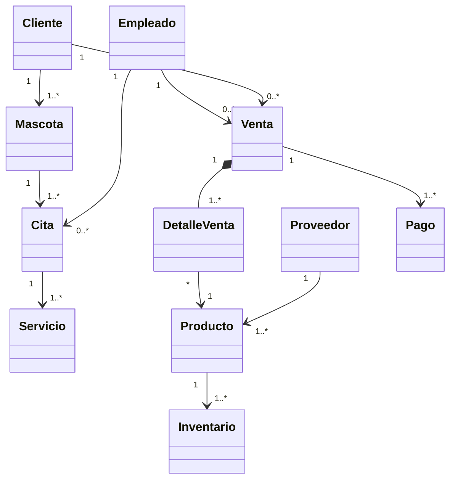
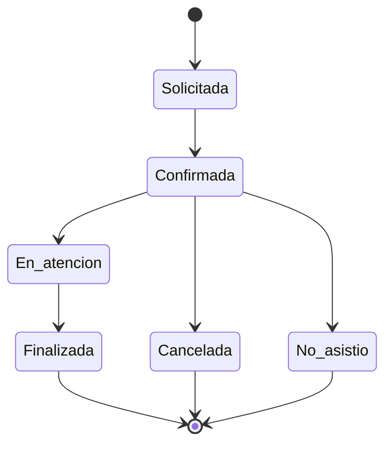
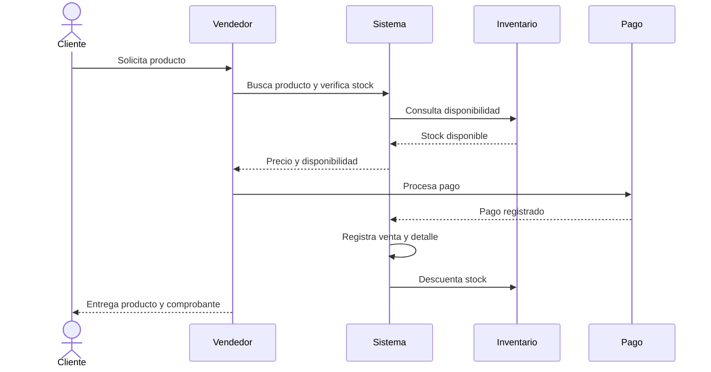

# Sistema de Gestión Integral - Pet Shop

Proyecto preparado a partir de la guía práctica **Pet Shop**. La estructura está organizada como un pequeño proyecto Java para que GitHub y GitDiagram puedan reconocer componentes, clases y relaciones del sistema.

## Objetivo

Modelar un sistema de gestión para una tienda de mascotas que integra:

- Clientes y mascotas
- Productos y proveedores
- Ventas y detalle de ventas
- Pagos
- Citas y servicios
- Inventario

## Clases del dominio

1. Cliente
2. Mascota
3. Empleado
4. Servicio
5. Cita
6. Producto
7. Proveedor
8. Venta
9. DetalleVenta
10. Pago
11. Inventario

## Relaciones principales

- Cliente 1 ---- 1..* Mascota
- Mascota 1 ---- 1..* Cita
- Empleado 1 ---- 0..* Cita
- Empleado 1 ---- 0..* Venta
- Cita 1 ---- 1..* Servicio
- Cliente 1 ---- 0..* Venta
- Venta 1 ---- 1..* DetalleVenta
- DetalleVenta * ---- 1 Producto
- Venta 1 ---- 1..* Pago
- Proveedor 1 ---- 1..* Producto
- Producto 1 ---- 1..* Inventario

## Diagramas en GitHub

GitHub puede mostrar Mermaid directamente desde Markdown.

### Diagrama de clases



### Ciclo de vida de una cita



### Flujo de venta



## GitDiagram

Después de subir esta carpeta a un repositorio público de GitHub, se puede abrir el repositorio en GitDiagram. GitDiagram genera un diagrama de arquitectura a partir del árbol del repositorio y del README, y permite navegar desde los componentes hacia los archivos fuente.

**Importante:** GitDiagram no sustituye los diagramas UML académicos. En este proyecto se incluyen ambos: los archivos Java para que GitDiagram entienda la estructura y los diagramas Mermaid para que los diagramas de clases, estados y secuencia se vean directamente en GitHub.

## Estructura

```text
PetShop-GitDiagram/
├── README.md
├── docs/
│   └── diagramas.md
└── src/
    └── petshop/
        └── model/
            ├── Cliente.java
            ├── Mascota.java
            ├── Empleado.java
            ├── Servicio.java
            ├── Cita.java
            ├── Producto.java
            ├── Proveedor.java
            ├── Venta.java
            ├── DetalleVenta.java
            ├── Pago.java
            └── Inventario.java
```
