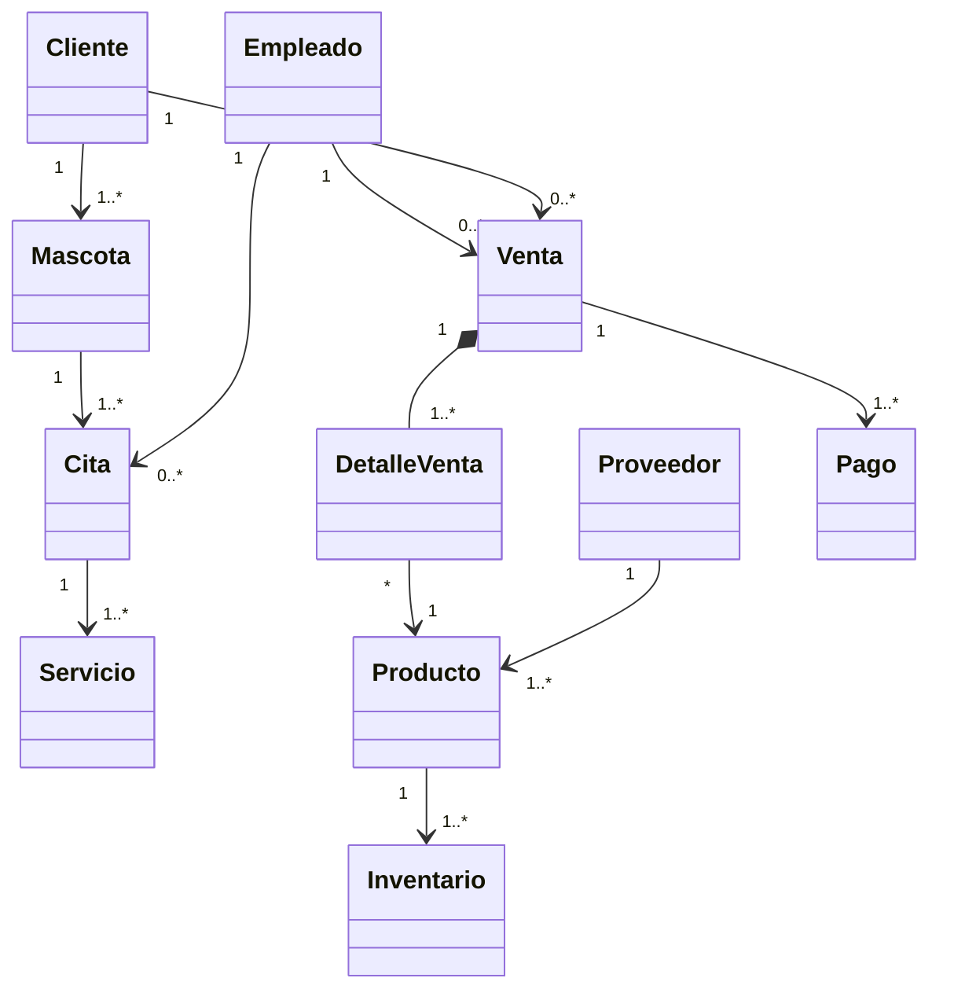
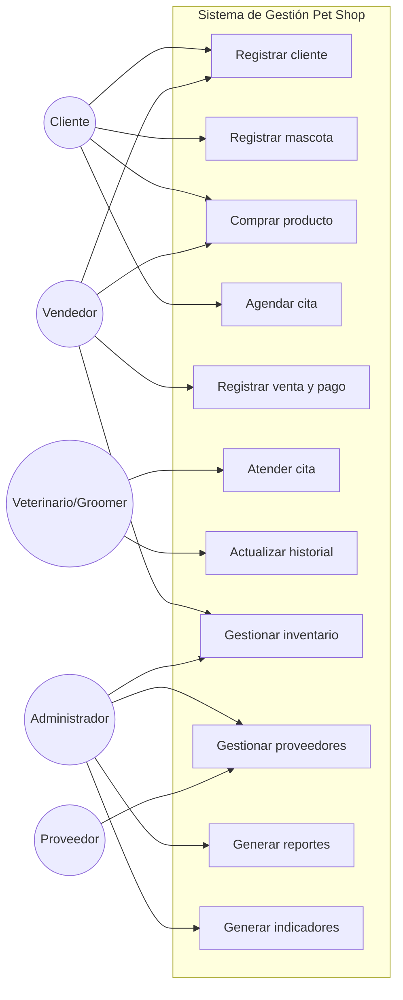
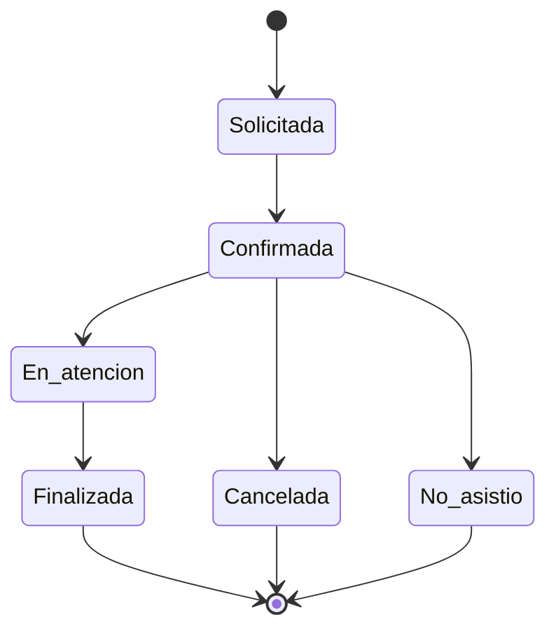
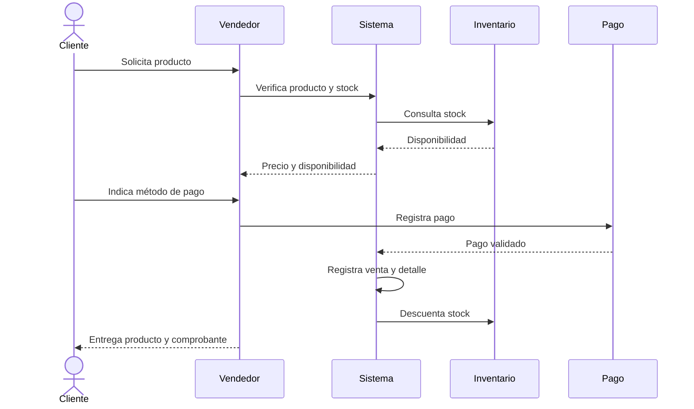

# Diagramas UML - Pet Shop

## 1. Diagrama de clases

```mermaid
classDiagram
    class Cliente
    class Mascota
    class Empleado
    class Servicio
    class Cita
    class Producto
    class Proveedor
    class Venta
    class DetalleVenta
    class Pago
    class Inventario

    Cliente "1" --> "1..*" Mascota
    Mascota "1" --> "1..*" Cita
    Empleado "1" --> "0..*" Cita
    Empleado "1" --> "0..*" Venta
    Cita "1" --> "1..*" Servicio
    Cliente "1" --> "0..*" Venta
    Venta "1" *-- "1..*" DetalleVenta
    DetalleVenta "*" --> "1" Producto
    Venta "1" --> "1..*" Pago
    Proveedor "1" --> "1..*" Producto
    Producto "1" --> "1..*" Inventario
```

## 2. Casos de uso - actores principales

```mermaid
flowchart LR
    Cliente((Cliente))
    Vendedor((Vendedor))
    Groomer((Veterinario/Groomer))
    Admin((Administrador))
    Proveedor((Proveedor))

    subgraph Sistema["Sistema de Gestión Pet Shop"]
        UC1[Registrar cliente]
        UC2[Registrar mascota]
        UC3[Comprar producto]
        UC4[Agendar cita]
        UC5[Registrar venta y pago]
        UC6[Atender cita]
        UC7[Actualizar historial]
        UC8[Gestionar inventario]
        UC9[Gestionar proveedores]
        UC10[Generar reportes]
        UC11[Generar indicadores]
    end

    Cliente --> UC1
    Cliente --> UC2
    Cliente --> UC3
    Cliente --> UC4
    Vendedor --> UC1
    Vendedor --> UC3
    Vendedor --> UC5
    Vendedor --> UC8
    Groomer --> UC6
    Groomer --> UC7
    Admin --> UC8
    Admin --> UC9
    Admin --> UC10
    Admin --> UC11
    Proveedor --> UC9
```

## 3. Diagrama de estados de Cita

```mermaid
stateDiagram-v2
    [*] --> Solicitada
    Solicitada --> Confirmada
    Confirmada --> En_atencion
    En_atencion --> Finalizada
    Confirmada --> Cancelada
    Confirmada --> No_asistio
    Finalizada --> [*]
    Cancelada --> [*]
    No_asistio --> [*]
```

## 4. Secuencia de venta

```mermaid
sequenceDiagram
    actor Cliente
    participant Vendedor
    participant Sistema
    participant Inventario
    participant Pago

    Cliente->>Vendedor: Solicita producto
    Vendedor->>Sistema: Verifica producto y stock
    Sistema->>Inventario: Consulta stock
    Inventario-->>Sistema: Disponibilidad
    Sistema-->>Vendedor: Precio y disponibilidad
    Cliente->>Vendedor: Indica método de pago
    Vendedor->>Pago: Registra pago
    Pago-->>Sistema: Pago validado
    Sistema->>Sistema: Registra venta y detalle
    Sistema->>Inventario: Descuenta stock
    Vendedor-->>Cliente: Entrega producto y comprobante
```
